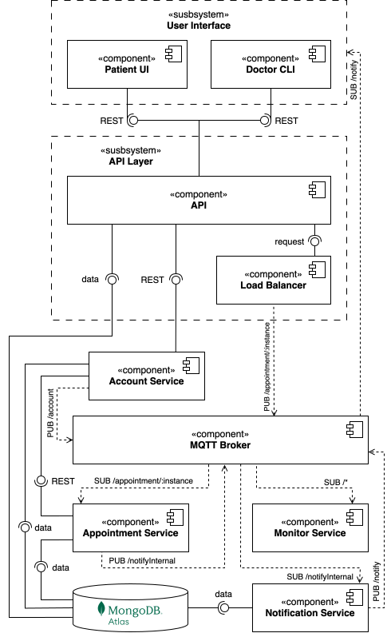

# Toothies

### Table of contents
[[_TOC_]]

### Project Overview

TODO

### Requirements

For a detailed list of requirements, please visit the [Wiki](https://git.chalmers.se/courses/dit355/2024/student_teams/dit356_2024_04/toothies/-/wikis/requirements).

### System architecture

Component diagram

